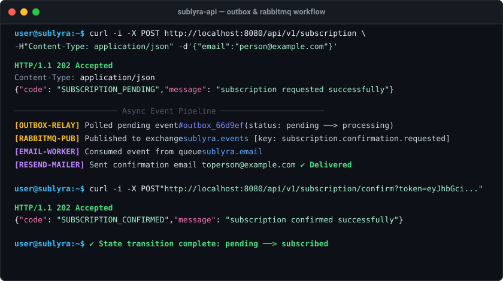

# 📬 sublyra-api — documentação técnica

`sublyra-api` é um projeto de estudo sobre fluxos confiáveis e assíncronos de inscrição. Ele oferece uma API HTTP para inscrição e cancelamento de newsletters, persiste o estado das inscrições no MongoDB, registra eventos de integração usando o padrão **Transactional Outbox** e processa o envio assíncrono de e-mails via **RabbitMQ** e **Resend**.



To read this documentation in English, see [`README.md`](README.md).

## Arquitetura

O código segue uma estrutura inspirada em Ports and Adapters (Arquitetura Hexagonal) e usa Uber Fx para injeção de dependências e gerenciamento do ciclo de vida da aplicação.

```text
cmd/api/                         ponto de entrada da aplicação
internal/
├── config/                      configuração do ambiente
├── core/
│   ├── domain/                  modelos de inscrição, outbox e eventos de domínio
│   ├── ports/                   contratos de erros da aplicação
│   └── services/                casos de uso de inscrição
├── inbound/http/rest/           controllers, DTOs e middlewares Fiber
├── infra/                       servidor HTTP, logger, MongoDB, RabbitMQ e mailer Resend
├── outbound/
│   ├── mongodb/                 repositórios e schemas MongoDB
│   └── rabbitmq/                topologia RabbitMQ, publisher e workers assíncronos (relay, email)
└── platform/                    utilitários de JWT e validação
```

O fluxo de dados é assíncrono e resiliente:

```text
Requisição HTTP → Controller Fiber → Serviço de Inscrição → Repositório MongoDB
                                                             ├─ subscriptions
                                                             └─ outbox (pending)
                                                                     │
                                                                     ▼
                                                             Outbox Relay Worker
                                                                     │
                                                                     ▼
                                                             Exchange RabbitMQ (sublyra.events)
                                                                     │
                                                                     ▼
                                                             Worker Consumer de E-mail
                                                                     │
                                                                     ▼
                                                             API Resend (Mailer)
```

Principais tecnologias: Go 1.26.3, Fiber v3, MongoDB Go Driver v2, RabbitMQ (amqp091-go), Resend Go SDK, Uber Fx e JWT.

## Transactional Outbox e Pipeline Assíncrono

O principal padrão estudado aqui é a solução do problema da escrita dupla (dual-write). Uma solicitação de inscrição precisa atualizar o estado de negócio e, posteriormente, disparar um efeito colateral externo (envio de e-mail). Gravar no MongoDB e chamar diretamente uma API externa são duas operações independentes: uma pode ter sucesso enquanto a outra falha.

A implementação grava ambos os documentos dentro de uma única transação do MongoDB:

1. O serviço cria ou atualiza um documento em `subscriptions.subscriptions`.
2. Na mesma transação, adiciona um evento de integração em `subscriptions.outbox` com status `pending`.
3. O MongoDB confirma ambas as operações de forma atômica ou desfaz ambas.
4. O **Outbox Relay Worker** consulta continuamente eventos pendentes na outbox, atualiza seu status para `processing` e os publica no exchange do RabbitMQ (`sublyra.events`). Após a publicação com sucesso, o status do evento na outbox passa para `published`.
5. O **Worker Consumer de E-mail** consome eventos da fila do RabbitMQ (`sublyra.email`), renderiza os templates HTML (`confirmation.html` ou `cancellation.html`) e envia os e-mails via **API Resend**.
6. Após o envio bem-sucedido do e-mail, o status do evento na outbox é atualizado para `delivered`. Caso ocorra uma falha ou o limite de tentativas seja atingido, a mensagem é encaminhada para filas de retry/DLQ e marcada como `failed`.

Os métodos transacionais são `InsertWithOutbox`, `RenewConfirmationWithOutbox` e `RenewUnsubscribedWithOutbox`, localizados no repositório MongoDB de inscrições.

### Requisito importante do MongoDB

Transações do MongoDB envolvendo múltiplos documentos exigem um replica set ou cluster fragmentado. Uma instância standalone não é suficiente. O ambiente local deve apontar `MONGO_URI` para uma implantação configurada como replica set.

### Collections

`subscriptions.subscriptions` armazena o agregado:

```json
{
  "_id": "ObjectId",
  "email": "person@example.com",
  "status": "pending | subscribed | unsubscribed",
  "confirmation_token": "JWT opcional",
  "unsubscribe_token": "JWT opcional",
  "subscribed_at": "datetime opcional",
  "unsubscribed_at": "datetime opcional",
  "created_at": "datetime",
  "updated_at": "datetime"
}
```

O campo `email` possui um índice único.

`subscriptions.outbox` armazena os eventos de integração:

```json
{
  "_id": "ObjectId",
  "aggregate_id": "ObjectId da inscrição",
  "email": "person@example.com",
  "event": "outbox_subscription_confirmation_requested | outbox_subscription_cancellation_requested",
  "attempts": 0,
  "payload": {
    "email": "person@example.com",
    "status": "pending",
    "confirmation_token": "JWT"
  },
  "status": "pending | processing | published | delivered | failed",
  "last_error": "mensagem de erro opcional",
  "published_at": "datetime opcional",
  "created_at": "datetime",
  "updated_at": "datetime"
}
```

Eventos suportados:
- `outbox_subscription_confirmation_requested`
- `outbox_subscription_cancellation_requested`

## Ciclo de vida da inscrição

```text
novo e-mail ──solicitação──> pending ──confirma token──> subscribed
                                 ▲                            │
                                 │                            │ solicita cancelamento
                                 │                            ▼
                        renova solicitação <── unsubscribed <── confirma token
```

Os tokens de confirmação e cancelamento são JWTs com duração de 15 minutos. O token armazenado no documento da inscrição deve corresponder ao token recebido antes que a transição de estado seja aceita.

## API HTTP

Caminho base: `/api/v1`

| Método | Caminho | Corpo/query | Sucesso |
| --- | --- | --- | --- |
| `POST` | `/subscription` | `{"email":"person@example.com"}` | `202 Accepted` |
| `POST` | `/subscription/confirm?token=...` | JWT como query parameter | `202 Accepted` |
| `POST` | `/unsubscription` | `{"email":"person@example.com"}` | `202 Accepted` |
| `POST` | `/unsubscription/confirm?token=...` | JWT como query parameter | `202 Accepted` |

```bash
curl -i -X POST http://localhost:8080/api/v1/subscription \
  -H "Content-Type: application/json" \
  -d '{"email":"person@example.com"}'
```

As respostas bem-sucedidas usam códigos de aplicação estáveis, como `SUBSCRIPTION_PENDING`, `SUBSCRIPTION_CONFIRMED`, `UNSUBSCRIPTION_PENDING` e `UNSUBSCRIPTION_CONFIRMED`.

Atualmente, o servidor aplica logging das requisições, recuperação de panics, IDs de requisição e um rate limit em memória de 3 requisições a cada 30 segundos. Há requisições prontas para execução em [`.http/subscriptions.http`](../.http/subscriptions.http).

## Topologia RabbitMQ e Arquitetura de Mensageria

A aplicação declara automaticamente a topologia de mensageria durante a inicialização:

- **Exchanges**:
  - `sublyra.events` (`direct`, durável): Exchange principal de eventos.
  - `sublyra.retry` (`direct`, durável): Exchange de espera para retenção e retentativas com atraso (30s TTL).
  - `sublyra.dlx` (`direct`, durável): Exchange Dead-Letter para mensagens irrecuperáveis ou que esgotaram tentativas.
- **Queues**:
  - `sublyra.email`: Fila ativa de consumo de e-mails (configurada com `x-dead-letter-exchange: sublyra.retry`).
  - `sublyra.email.retry`: Fila temporária de retenção com `x-message-ttl: 30000` (30s) que redireciona de volta para `sublyra.events`.
  - `sublyra.email.dlq`: Fila Dead-Letter para mensagens que falharam ou são inválidas.
- **Routing Keys**:
  - `subscription.confirmation.requested`
  - `subscription.cancellation.requested`
  - `subscription.email.retry`
  - `subscription.dead`

## Configuração

| Variável | Obrigatória | Padrão | Finalidade |
| --- | --- | --- | --- |
| `SERVER_HOST` | não | `localhost` | Endereço de bind HTTP |
| `SERVER_PORT` | não | `8080` | Porta HTTP |
| `APP_SCHEME` | não | `http` | Esquema/Protocolo (http/https) utilizado para montar URLs de confirmação/cancelamento |
| `APP_HOST` | não | `localhost:8080` | Host/Domínio da aplicação utilizado para montar URLs de confirmação/cancelamento |
| `MONGO_URI` | sim | — | URI de conexão com o replica set MongoDB |
| `JWT_SECRET_KEY` | sim | — | Chave secreta para assinar os JWTs de confirmação e cancelamento |
| `RABBITMQ_URI` | sim | — | URI de conexão AMQP com o RabbitMQ |
| `RESEND_SECRET_KEY` | sim | — | Chave de API do Resend para envio de notificações por e-mail |
| `RESEND_FROM_EMAIL` | não | `onboarding@resend.dev` | Endereço de remetente dos e-mails disparados |
| `OUTBOX_POLL_INTERVAL` | não | `2s` | Intervalo de polling do relay da outbox |
| `OUTBOX_BATCH_SIZE` | não | `50` | Tamanho máximo do lote de eventos buscados na outbox |
| `OUTBOX_MAX_ATTEMPTS` | não | `5` | Número máximo de tentativas de reprocessamento antes de marcar evento como `failed` |
| `OUTBOX_TTL_SECONDS` | não | `604800` | Tempo de retenção TTL em segundos para eventos da outbox no MongoDB (padrão: 7 dias) |
| `RABBITMQ_PREFETCH` | não | `5` | Limite de prefetch do consumidor no canal do RabbitMQ |

Não versione credenciais reais. Use valores locais em `.env` e mantenha apenas placeholders em `.env.example`.

## Comandos de desenvolvimento

```bash
make run               # go run ./cmd/api
make test              # go test ./...
make test-integration  # go test -v -tags=integration ./...
make fmt               # go fmt ./...
make tidy              # go mod tidy
make lint              # golangci-lint run
make build             # compila bin/api
```

## Testes

Execute a suíte de testes unitários com:

```bash
go test ./... -count=1 -cover
```

Execute a suíte automatizada de testes de integração (utiliza `testcontainers-go` para subir containers efêmeros do MongoDB replica set e do RabbitMQ):

```bash
make test-integration
# ou
go test -v -tags=integration ./...
```

A suíte de testes unitários cobre a lógica do domínio, transições de estado, regras de cooldown, geração e validação de JWT, construção dos documentos da outbox, mappers de schema dos repositórios, declaração da topologia RabbitMQ e roteamento do publisher.
A suíte de testes de integração valida as transações atômicas multi-documentos no MongoDB, o claiming atômico de eventos na outbox (`FindOneAndUpdate`) e a entrega de ponta a ponta na pipeline de mensageria do RabbitMQ.

## Infraestrutura Docker

O Docker Compose provisiona todo o ambiente com Alta Disponibilidade pronta para produção: MongoDB 8.0 com replica set de 3 nós (`mongo1`, `mongo2`, `mongo3`), RabbitMQ 4 com painel de gerenciamento (Management UI) e o container da API.

```bash
docker compose -f docker/docker-compose.yml up --build
```

Portas expostas:
- **API**: `http://localhost:8080`
- **MongoDB Nó 1 (Primary/Secondary)**: `localhost:27017`
- **MongoDB Nó 2 (Primary/Secondary)**: `localhost:27018`
- **MongoDB Nó 3 (Primary/Secondary)**: `localhost:27019`
- **RabbitMQ AMQP**: `localhost:5672`
- **Painel de Gerenciamento RabbitMQ**: `http://localhost:15672` (credenciais: `guest` / `guest`)

O estado do banco de dados e do broker de mensagens é persistido nos volumes nomeados `mongo1_data`, `mongo2_data`, `mongo3_data` e `rabbitmq_data`. Para encerrar os serviços preservando os dados, execute `docker compose -f docker/docker-compose.yml down`. Adicione `--volumes` apenas se desejar excluir os dados locais.

## Status da Arquitetura

Todas as principais funcionalidades arquiteturais, Alta Disponibilidade do MongoDB em Replica Set (3 nós), políticas de CORS, retenção por índice TTL, Health Checks estruturados (`/health`), claiming atômico da outbox e testes de integração com `testcontainers-go` estão totalmente implementados e funcionais!
